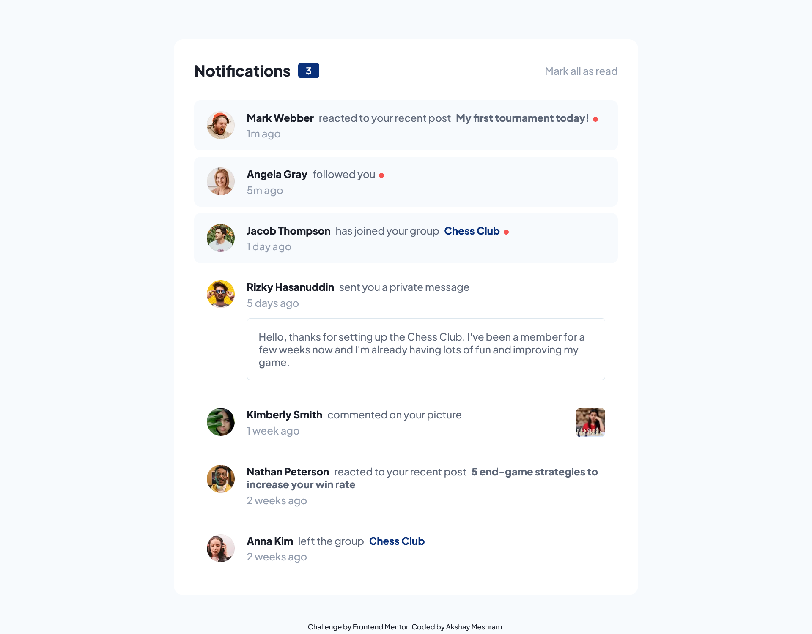

# Frontend Mentor - Notifications page solution

This is a solution to the [Notifications page challenge on Frontend Mentor](https://www.frontendmentor.io/challenges/notifications-page-DqK5QAmKbC). Frontend Mentor challenges help you improve your coding skills by building realistic projects.

## Table of contents

- [Overview](#overview)
  - [The challenge](#the-challenge)
  - [Screenshot](#screenshot)
  - [Links](#links)
- [My process](#my-process)
  - [Built with](#built-with)
  - [What I learned](#what-i-learned)
  - [Continued development](#continued-development)
- [Author](#author)

## Overview

### The challenge

Users should be able to:

- View the optimal layout depending on their device's screen size

### Screenshot

### Links

- Solution URL: [https://www.frontendmentor.io/solutions/responsive-notification-card-component-cqxkMzOkqZ](https://www.frontendmentor.io/solutions/responsive-notification-card-component-cqxkMzOkqZ)
- Live Site URL: [https://notifications-page-theta.vercel.app/)

## My process

### Built with

- Semantic HTML5 markup
- Flexbox

### What I learned

How to change visual states.

### Continued development

I'll add more dynamic behavior to this component in the future.

## Author

- Frontend Mentor - [@akshay63](https://www.frontendmentor.io/profile/akshay63)
- Twitter - [@aka_akshaymesh](https://www.twitter.com/aka_akshaymesh)
